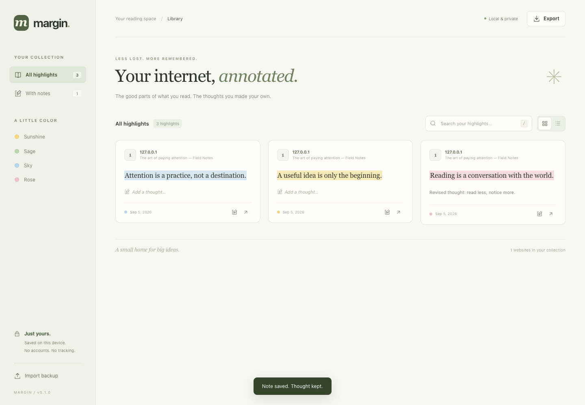

# Margin

**Your internet, annotated.** A local-first Chrome extension for highlighting passages, leaving notes, and returning to the good parts of your reading. Application code is ClojureScript; Clojure/Shadow CLJS provides the compiler and REPL. No backend, account, telemetry, or remote assets.



## Install in Chrome

The built extension lives in **`extension/`**. If `extension/js/` is already present, skip the build step.

1. Install **Node.js 20+** and **Java 17+** (Java 21 recommended).
2. In this project directory, run:
   ```sh
   npm ci
   npm run build
   ```
   The first build downloads Clojure/compiler dependencies from Maven Central and Clojars.
3. Open **`chrome://extensions`**.
4. Enable **Developer mode** in the upper-right corner.
5. Click **Load unpacked**, then choose this project's **`extension/`** directory—not the project root.
6. Pin Margin using Chrome's puzzle-piece menu. **Refresh any already-open website tabs once.**

Chrome 105+ is required. A current stable Chrome release is recommended. There is no Chrome Web Store listing yet.

## Use it

- **Highlight:** select text on an ordinary web page. Click Sunshine, Sage, Sky, or Rose in the floating toolbar.
- **Annotate:** select text and click **Note**. Write a thought, choose a color, and save. `⌘/Ctrl + Enter` also saves.
- **Edit:** click a saved highlight on the page. You can edit its note, change its color, or delete it.
- **Revisit:** click Margin's toolbar icon for this page's saved passages, or open **Your library**. The ↗ button opens the original URL in a new tab, scrolls to the passage, and opens its note.
- **Find:** search the library by passage, note, page title, or URL. Search words are combined with AND. Filter by color or notes; switch between grid and list layouts. Press `/` to focus search.
- **Back up:** choose **Export → JSON backup** for a restorable copy, or **Markdown notes** for a portable reading notebook. **Import backup** merges a version-1 JSON backup without overwriting local IDs. Invalid backups are rejected as a whole.

Notes are saved explicitly—not on every keystroke. Closing a dirty editor asks before discarding it. Both editors support Escape. Library dialogs support normal keyboard focus trapping.

## Privacy and permissions

- **`storage`:** saved highlights/notes in `chrome.storage.local`; temporary “revisit this passage” requests in `chrome.storage.session`.
- **`activeTab`:** identify the page when you click the toolbar popup.
- **HTTP/HTTPS content-script access:** show the selection toolbar and restore highlights automatically on websites. Chrome describes this as website access. There is no `tabs`, history, clipboard, or network API permission.
- No pages are uploaded, no remote favicon requests are made, and no third-party scripts or fonts are loaded. Only selected text, limited surrounding context (64 characters on either side), the source URL/title, note, color, and timestamps are persisted.
- **Storage is local, not encrypted or synced.** Anyone with access to the browser profile may access it. Exports also contain your notes and source URLs. Keep backups somewhere private.
- Uninstalling the extension or deleting its browser profile removes its data. Export a backup first. Chrome's local storage quota applies (10 MB on modern Chrome; older versions may allow 5 MB). Failed writes show an error and leave existing data intact.

## How restoration works

Each annotation stores an exact text quote, its prefix/suffix, and UTF-16 text offsets. On return, Margin indexes eligible visible text nodes and resolves the quote, using surrounding context to choose among duplicate occurrences. If whitespace changed, a normalized-text fallback maps back to original DOM offsets. No fuzzy semantic matching is attempted.

Highlights use the **CSS Custom Highlight API**: page content is not wrapped in `<mark>` elements or rewritten. The toolbar and editor use a **Shadow DOM** to isolate their styles. DOM mutations trigger coalesced restoration; idle pages without annotations aren't continually indexed. URL changes made through the History API are detected, too.

A Manifest V3 service worker owns all data mutations and serializes them through a promise queue, so simultaneous saves from different tabs don't overwrite each other. Storage events update open libraries, popups, and page highlights. All page titles, quotes, notes, and imported text are rendered as text—not HTML.

## Scope and limitations

- Intended for **ordinary, selectable text in the top-level HTML document**. Chrome internal pages, the Chrome Web Store, built-in PDF viewer, `file://` pages, image/canvas text, embedded frames, shadow-root content, and editable form fields are not supported.
- Highlights are **not snapshots or an offline reading cache**. If the source disappears, your saved quote/note remains in the library but the original page may not open.
- If a passage is removed or substantially rewritten, Margin cannot reliably relocate it. On a revisit request, it retries for up to eight seconds for delayed content, then opens the saved quote with an explanation instead of inventing a match.
- Query strings distinguish pages; fragments do not. Hash-only SPA routes, heavily virtualized pages, changing personalized URLs, and aggressive page scripts may need future site-specific handling. Chrome site-access settings can also prevent injection.
- Limits: 20,000 characters per passage, 30,000 per note; backup import up to 20 MB / 10,000 records, still subject to Chrome's storage quota.
- There is no cloud sync, collaborative annotation, tagging, or full-text page archive in this version.

## Development

```sh
npm run dev             # Watch ClojureScript and emit MV3-safe release bundles
npm run build           # One optimized production build
npm test                # ClojureScript model + anchor tests on Node
npm run lint            # Requires clj-kondo on PATH
npx playwright install chromium
npm run test:browser    # Real Chromium, real unpacked extension, disposable profile
npm run package         # Build + dist/margin-0.1.0.zip (requires zip on PATH)
npm run icons           # Regenerate the checked-in PNG icons, no dependencies
```

`npm run dev` uses release compilation intentionally: Chrome MV3 forbids the eval-based loaders used by conventional browser hot-reloading. After a rebuild, **reload the extension in `chrome://extensions` and refresh the page being tested**. Static CSS/HTML changes only need a page refresh. Generated JS is ignored by Git; a clone needs a build. `package-lock.json` locks the JavaScript/compiler toolchain.

For a standalone ClojureScript Node REPL:

```sh
npx shadow-cljs node-repl
```

```clojure
(require '[margin.anchor :as anchor])
(def selector (anchor/selector "Read this useful idea today." 10 21))
(anchor/locate "Read this useful   idea today." selector)
;; => [10 23]
```

A running Shadow server exposes nREPL on **8777**. When using nREPL programmatically, `shadow.cljs.devtools.api/cljs-eval` evaluates in a running CLJS build; a plain nREPL `eval` otherwise runs JVM Clojure.

### Project map

```text
src/margin/
  model.cljs        Data validation, page identity, search, import/export
  anchor.cljs       Pure quote/context/position anchoring
  async.cljs        Chrome callback → Promise adapters
  background.cljs   MV3 worker: single-writer storage, messaging, revisit routing
  content.cljs      DOM indexing, highlights, selection toolbar, note editor
  library.cljs      Searchable library and editing/backup UI
  popup.cljs        Current-page overview and library entry point
  ui.cljs           Small safe Hiccup → DOM renderer, icons, shared UI helpers
extension/
  manifest.json     MV3 manifest
  worker.js         Loads compiled worker bundles
  library.html      Library entry point
  popup.html        Toolbar popup entry point
  styles.css        Shared extension-page styles, responsive layouts
  icons/            Generated PNG icons (checked in)
  js/               Generated optimized ClojureScript (not checked in)
test/
  margin/           ClojureScript unit tests
  browser.mjs       Playwright integration checks
  fixtures/         Local article used by browser tests
scripts/            Build watcher, icon generator, ZIP packaging
```

The browser checks exercise selection across inline elements, all save paths, reload restoration/click hit testing, dynamic text replacement, whitespace changes, History API navigation, missing-passage fallbacks, live storage updates, library search/filter/edit/delete, opening a distant passage, backup round-tripping, unsafe URL/HTML protection, stale-update rejection, concurrent saves, and responsive/popup rendering. They run against a local fixture server and a temporary Chrome profile—never your normal profile. Screenshots are written to `target/screenshots/`.
